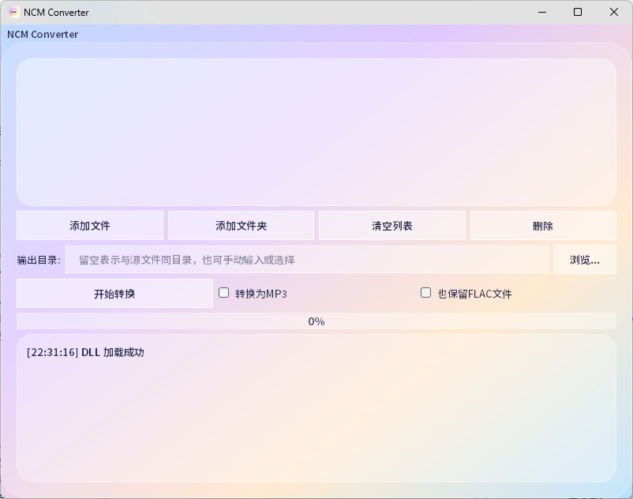

# NCM Converter

**NCM Converter** 是一款基于 Qt 和 C++ 开发的图形化工具，用于将网易云音乐加密的 `.ncm` 文件解密并转换为常见的音频格式（FLAC 或 MP3）。它提供了简洁、现代化的界面，支持批量处理、自定义输出目录，并集成了 FFmpeg 以实现高质量的 MP3 转换。



---

## 📌 功能特性

- ✅ **解密 .ncm 文件**：基于 `libncmdump` 核心库，兼容新版网易云音乐格式。
- ✅ **批量转换**：支持同时添加多个文件或整个文件夹（含子目录）。
- ✅ **输出格式选择**：可直接输出为源格式（FLAC/MP3），或一键转换为 MP3（192kbps）。
- ✅ **保留 FLAC 选项**：转换为 MP3 时可选择保留原始 FLAC 文件。
- ✅ **现代化 UI**：采用毛玻璃、圆角、渐变等设计，视觉风格明亮友好。
- ✅ **多平台支持**：使用 Qt 5.15.2 开发，可在 Windows 7 及以上系统运行。

---

## 📦 依赖组件

| 组件 | 用途 | 许可证 |
|------|------|--------|
| [libncmdump](https://github.com/taurusxin/ncmdump) | 核心解密引擎 | MIT |
| [FFmpeg](https://ffmpeg.org/) | MP3 编码转换 | LGPL-2.1+ |
| [Qt 5.15.2](https://www.qt.io/) | GUI 框架及工具链 | LGPL-3.0 / GPL-3.0 |

---

## 🔧 编译指南

### 环境要求
- Windows 7 / 10 / 11（开发测试基于 Win7）
- Visual Studio 2019、2022 或 2026（推荐）
- Qt 5.15.2（MSVC 2019 64-bit）
- CMake（可选，使用 qmake 时无需）

### 步骤
1. **克隆源码**
   ```bash
   git clone https://github.com/zhb3306/NCM-Converter.git
   cd NCM-Converter
